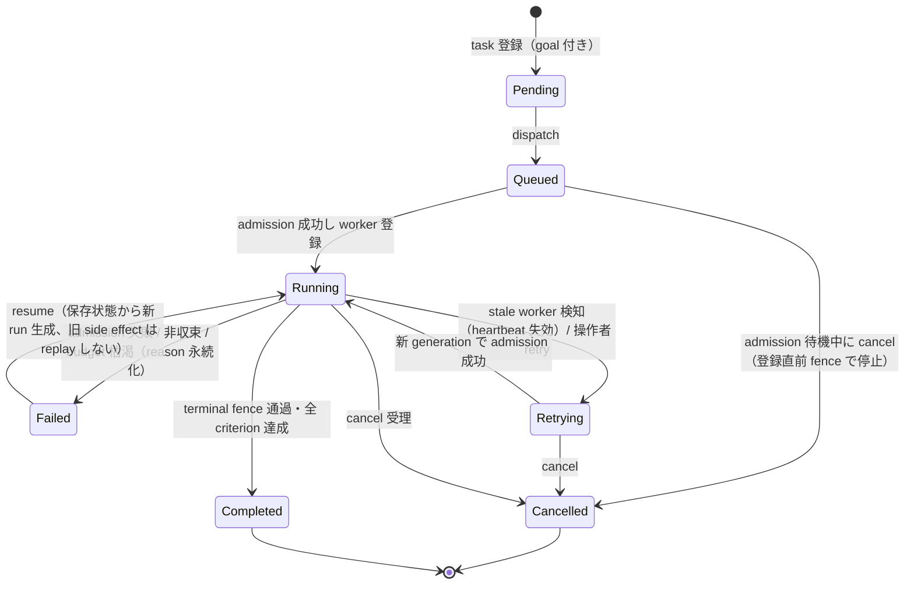
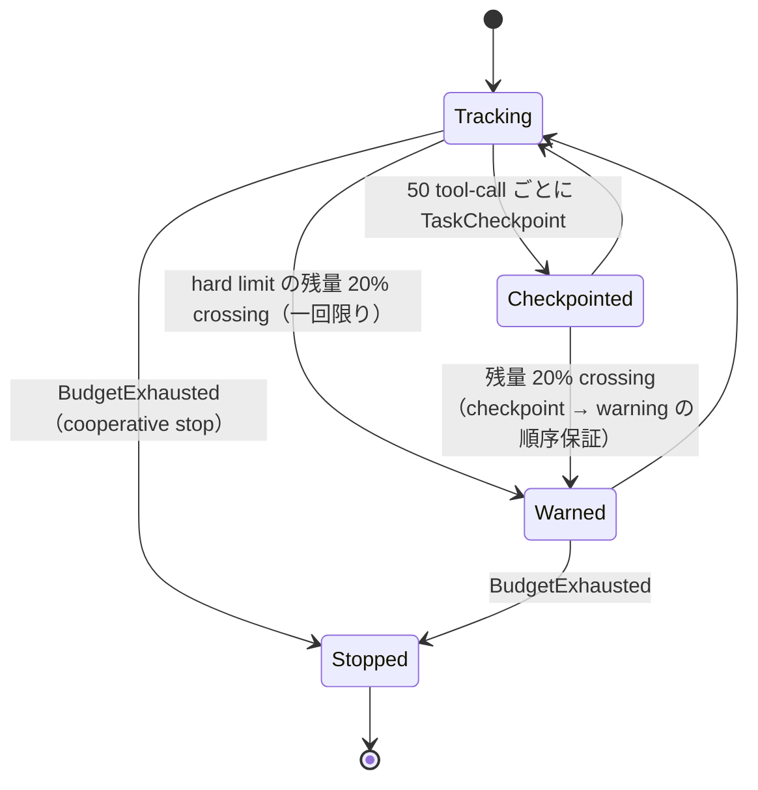

# Durable execution substrate — 状態遷移図（2026-09-18）

v07-durable-execution-substrate（issue #118 / PR #119 / ADR 0026）で実装された
durable task/run の状態遷移を示す。振る舞いの一次ソースは
`crates/runtime/src/orchestration/ledger/durable.rs` と
`crates/runtime/docs/durable-execution.md`。

## Durable task 状態機械

## 状態語彙

durable task の語彙（Pending / Queued / Blocked / Retrying / Running / Completed /
Failed / Cancelled）は shared orchestration vocabulary で、storage・supervisor・
replay・GUI が同一の typed representation を共有する。goal レベルの状態とは別物
（goal と durable task の scope が異なるため混同しない）。

## 復元可否 (restorable) は実行状態列挙とは別軸

`restorable` フラグと `non_restorable_reason` は Pending / Running / Waiting / Done の
ような実行状態列挙の一部ではなく、終端スナップショットの設定フィールドごとの
性質（renewable / blocking / security）を記録する独立した軸である。同じ実行状態の
間でも run の設定内容によって復元可否は変化する。ownership のみの記録に加え、
停止済みrootのmemory/findingやDynamicTeam履歴も、現在の呼出元が権限と設定を
明示し、子孫停止・claimなし・未確認副作用なしの条件を満たすcontinue/delegate入口で
継続できる。旧worker・lease・process・workspace branchは復元しない。diskだけに
基づく入口はrenewable記録を拒否し、hard blockerや安全系の拒否も維持する。分類と入口ごとの適否は
[ADR 0027: 復元契約と実行状態の分離](../../decisions/0027-restore-contract.md) を参照。

## フェンス

- **terminal fence**: Completed / Failed / Cancelled 到達後の遅延更新を拒否。
- **generation fence**: 現世代以外の heartbeat/report/review を拒否し、
  新旧 worker の更新衝突を防ぐ（`TaskRetryScheduled` は `goal_id` 必須で
  replay ownership が task_id 重複時も決定的）。

## Budget 遷移（warning 含む）

